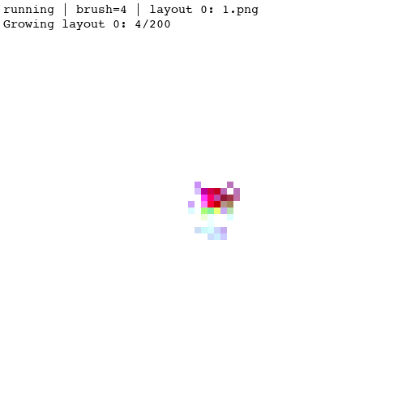
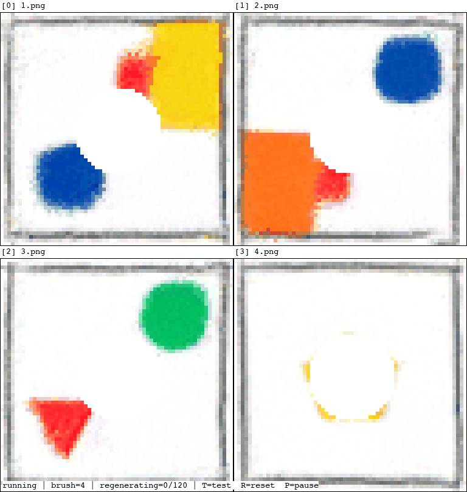
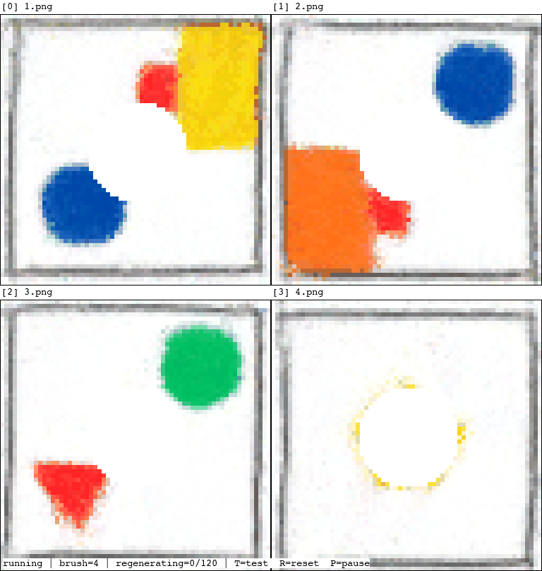

# 2D Neural Cellular Automata to 3D

This project trains a neural cellular automaton (NCA) to grow colored room layouts, move between multiple layouts, and recover from damage. Its developmental states are also converted into interactive 3D voxel scenes.

For the full methodology, experiments, and limitations, see the [Technical Review](Technical%20Review.pdf).

## Transition Training Comparison

The baseline model learns to grow each layout independently. Transition training teaches the NCA to morph between layouts; the review reports smoother transitions and stronger recovery after damage.

| Without transition training | With transition training |
| --- | --- |
|  |  |

## How It Works

- **Layout targets:** Four semantic room layouts are reduced to 64 x 64 grids. The NCA starts from a small seed and iteratively grows a target layout.
- **Conditioning:** A layout vector is broadcast across the grid so one model can generate different layouts. During transition training, the condition changes during growth to teach state-to-state morphing.
- **Self-repair:** Training periodically removes circular regions from evolving patterns, encouraging the NCA to reconstruct damaged structures.
- **3D conversion:** Recorded intermediate NCA states, including cell visibility and color information, are mapped to voxels. The HTML viewer provides 3D orbit controls and a growth timeline.

The model uses a 16-channel cell state and fixed Sobel/identity perception filters. The transition-conditioned network combines those perceived features with the layout condition before updating the cell state.

## Project Files

- `NCA Training Colab.ipynb` and `Conditional NCA Colab.ipynb`: training notebooks.
- `NCA Model.pt` and `Conditional NCA Model.pt`: saved model weights; `NCA All Transitions.npz`: recorded transition data.
- `build_viewer.py` and `view_nca_conditional.py`: 3D viewer generation and display code.
- `model_GIFS/`: animated training and transition examples.

## Notes

The current 3D extrusion works best for connected layouts with a supporting floor plane. NCA growth can also retain some high-frequency boundary noise.
